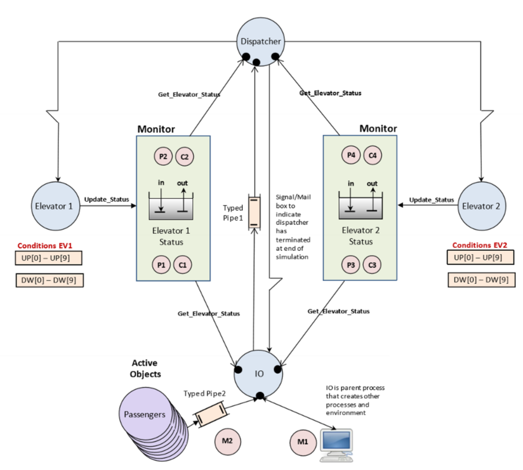

# Elevator-System-Simulation
University of British Columbia  
System Software Engineering (CPEN)  
- Isabelle Andre
- Justin Chang

An elevator system simulation model of a ten-story duplex using concurrent programming, multi-threading,
and thread synchronization.

### Model Specifications
* A double elevator system responds to requests made either from within the elevator, or from requests made outside the elevator for transportation of passengers up or down and to the specified destination floors.
* Both Elevator status are displayed at all time using monitors, including elevator direction, general status, door status, and current floor number

#### Simulating a Passenger Requesting Transport From Outside the Elevator on a Given Floor
* A passenger requesting to go up or down from a given floor is simulated by entering two character commands
* The first character *u* or *d* represents the direction passenger wishes to go
* The second character, a number from *0-9*, represents the passenger's current floor
* *eg. u0, d9, u1*

#### Simulating a Passenger Requesting Transport Once Inside the Elevator
* A passenger requesting elevator movement from inside the elevator involves entering a two character keyboard sequence
* The first character indicates the elevator number, *1* or *2* respectively
* The second character in the range *0-9* indicates the floor number passenger wishes to travel to
* *eg. 13, 28, 14* 

#### Simulating Elevator Faults and Halting the System
* Fault simulation is implemented and generated by entering *+1, -1, +2, -2*
* The *-* sign informs the simulator that a fualt has occured with the numbered elevator and that it is effectively out of action
* Rhe *+* sign indicates that the fault has been cleared and operation can resume with that elevator
* Each elevator suspends its actions immediately upon receipt of a simulated fault condition, and ignores all subsequent commands other than the end of the simulation or clearing of the fault

#### Dynamic Passengers
* To enable this feature, press character sequence *d+*. To end this feature, press character sequence *d-*
* Passengers are created as active objects and are designed to be generated at random outside a floor to request to go up or down
* once inside the elevator, passengers may request to travel to a specific floor and waits for the elevator doors to open at specified floor before getting off

#### Ending the Simulation
* Simulation may be terminated at anytime by entering the two character sequence *ee*
* All elevators are returned to the ground floor before the doors open
* No further commands are accepted

### Elevator Simulation Command Summary
Request Transport From Outside Elevator: Direction - *u* or *d*, Current Floor: Number Range *0-9*
Request Transport From Inside Elevator: Elevator Number - *1* or *2*, Destination Floor: Number Range *0-9*
Fault Simulation: Elevator In or Out of Order - *+* or *-*, Elevator Number - *1* or *2*
Enable Dynamic Passengers: Enable Feature - *d+*, Disable Feature - *d-*
End Simulation: *ee*

### Elevator System Multi-threading Diagram

